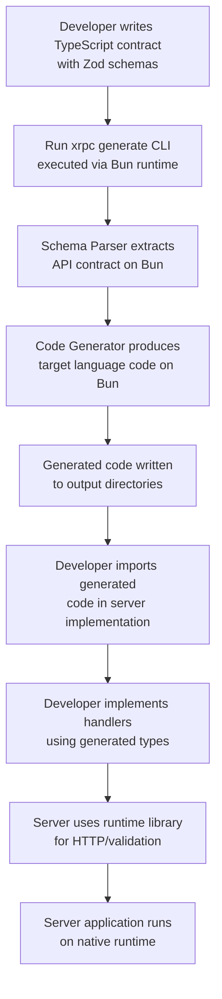

# xRpc Architecture

This document describes the system architecture, building blocks, and how modules interact.

## System Overview

xRpc is a code generation system with three main phases:
1. **Parse**: Extract API contract from TypeScript/Zod schemas
2. **Generate**: Produce type-safe clients and servers for multiple languages
3. **Runtime**: Execute generated code with validation and type safety

## High-Level Architecture

The system consists of four main layers:

**Input Layer**: TypeScript source files with Zod schemas defining API contracts

**Processing Layer**: Parser and code generator that transform schemas into target language code

**Output Layer**: Generated SDKs (clients and servers) for each framework target

**Runtime Layer**: Generated code executes using standard HTTP/framework libraries

## Core Building Blocks

### 1. Schema Parser Module

**Purpose**: Extracts API contract structure from TypeScript source files

**Responsibilities**:
- Parse TypeScript AST
- Identify Zod schema definitions
- Extract router structure (primary grouping mechanism)
- Extract endpoint definitions (collections of endpoints) from router
- Extract endpoint definitions (queries and mutations) from endpoints
- Extract input and output data types
- Resolve type references

**Input**: TypeScript source files
**Output**: Normalized API contract representation (AST-like structure)

**Dependencies**: TypeScript compiler API, Zod schema analyzer

**Outputs to**: Code Generator Module

### 2. Code Generator Module

**Purpose**: Generates framework-specific, self-contained code for each target framework

**Responsibilities**:
- Map Zod types to target language types
- Generate type definitions
- Generate client SDK code using standard HTTP libraries
- Generate server code with framework-specific integration (Spring Boot controllers, Express middleware, Go http.Handler, etc.)
- Generate validation code from Zod schemas
- Format code per language/framework standards
- Manage imports/packages using standard libraries

**Input**: Normalized API contract from Parser
**Output**: Generated source code files for each framework target (e.g., `go`, `kotlin-spring-boot`, `typescript-express`)

**Dependencies**: Schema Parser Module, Type mapping system, Template engine

**Outputs to**: Generated SDK files (complete, self-contained)

**Framework-Specific Targets**:
- Each target generates code tailored to a specific framework
- Examples: `go` (generates `http.Handler`), `kotlin-spring-boot` (generates Spring `@RestController`), `typescript-express` (generates Express middleware)
- Generated code uses standard framework APIs and HTTP libraries
- No separate runtime libraries needed - everything is in generated code

**Sub-modules**:
- Type Mapper: Converts Zod types to target language types
- Template Engine: Framework-specific code templates
- Code Formatter: Formats generated code per language standards

### 3. Generated Code Modules

**Purpose**: Self-contained, framework-specific code that includes everything needed

**Structure**: Framework-specific targets (e.g., `go`, `kotlin-spring-boot`, `typescript-express`)

**Each Generated Code Module Contains**:

**Type Definitions**:
- Input/output types matching Zod schemas
- Language-specific type representations (structs, classes, data classes)

**Client Code**:
- HTTP client implementation using standard libraries
- Request serialization (to JSON)
- Response deserialization (from JSON)
- Error handling
- Type-safe method wrappers

**Server Code**:
- Framework-specific HTTP handler/controller
- Request parsing
- Route matching
- Input validation
- Handler invocation
- Output validation
- Response serialization
- Context management

**Validation Code**:
- Runtime validators generated from Zod schemas
- Input validation before handler execution
- Output validation before response
- Error reporting

**Framework Integration**:
- Direct integration with target framework (Spring Boot controllers, Express middleware, Go http.Handler, etc.)
- Uses standard HTTP/framework libraries (no custom runtime)

**Dependencies**: Standard HTTP libraries and framework APIs (net/http, Express, Spring Boot, etc.)

**Used by**: Developer applications - generated code is imported and handlers are implemented

### 4. Type System Module

**Purpose**: Maps Zod types to target language types

**Responsibilities**:
- Define type mapping rules for each language
- Handle primitive types (string, number, boolean)
- Handle complex types (objects, arrays, unions)
- Handle optional types and defaults
- Generate type-safe code

**Input**: Zod schema types
**Output**: Target language type definitions

**Dependencies**: Schema Parser Module

**Used by**: Code Generator Module

## Module Relationships

### Parse Phase Flow

```
TypeScript Source Files
    ↓
Schema Parser Module
    ├─→ TypeScript AST Parser
    ├─→ Zod Schema Extractor
    ├─→ Endpoint Discovery
    └─→ Type Reference Resolver
    ↓
Normalized API Contract
    ↓
Code Generator Module
```

### Generation Phase Flow

```
Normalized API Contract
    ↓
Code Generator Module
    ├─→ Type System Module (type mapping)
    ├─→ Client Code Generator
    ├─→ Server Code Generator
    └─→ Validation Code Generator
    ↓
Generated SDK Files (per language)
```

### Runtime Phase Flow

```
Generated Client Code
    ├─→ HTTP Client (standard library)
    ├─→ Serialization (JSON)
    └─→ Validation (generated from Zod)
    ↓
HTTP Request
    ↓
Generated Server Code
    ├─→ Request Parsing (framework API)
    ├─→ Validation (generated from Zod)
    └─→ Handler Invocation
    ↓
Handler Implementation (developer code)
    ↓
Response Serialization (JSON)
    ↓
HTTP Response
```

## Component Interactions

### Schema Parser → Code Generator

The parser produces a normalized representation of the API contract that the generator consumes. The contract includes:
- Router structure (primary grouping mechanism)
- All endpoints with their endpoints (organized within router)
- All endpoints with their types (query/mutation)
- Complete input/output type definitions
- Type dependencies

### Code Generator → Generated Code

The generator produces self-contained, framework-specific code that:
- Uses standard HTTP libraries (net/http, fetch, etc.)
- Uses standard framework APIs (Spring Boot, Express, Gin, etc.)
- Includes all HTTP client/server functionality
- Includes serialization/deserialization (JSON)
- Includes validation code generated from Zod schemas
- Includes framework-specific integration (controllers, middleware, handlers)

**No separate runtime libraries**: Generated code is complete and uses standard libraries that are either part of the language standard library or common framework dependencies.

## Data Flow

### Development Time (Code Generation)

1. Developer writes TypeScript with Zod schemas
2. Schema Parser reads source files and extracts contract
3. Code Generator produces target language code
4. Generated code is written to output directories
5. Developer imports generated code in their projects

### Runtime (Client Request)

1. Application code calls generated client method
2. Generated client code serializes input to JSON (using standard HTTP library)
3. HTTP POST request sent to server
4. Generated server code receives request (via framework API)
5. Generated server code parses and validates input (using generated validators)
6. Generated server code routes to appropriate handler
7. Handler executes business logic (developer implementation)
8. Generated server code validates output (using generated validators)
9. Generated server code serializes response to JSON (using framework API)
10. HTTP response sent back
11. Generated client code parses and validates response (using standard HTTP library)
12. Typed response returned to application code

## Code Generation and Integration

This section details how code generation is triggered, where generated code is written, and how it gets integrated into server applications.

### Code Generation Trigger

Code generation is triggered via the xRpc CLI command:

```bash
xrpc generate --targets <languages>
```

**Important**: The xRpc CLI and almost everything in the xRpc system is built with **Bun runtime**. This enables fast TypeScript execution and efficient code generation.

The CLI:
- Reads TypeScript source files containing Zod schemas and router definitions
- Processes the API contract from these files
- Generates code for the specified target languages
- Writes generated code to output directories

Code generation happens at **development/build time**, not at runtime. It's a build-time transformation that produces source code files for each target language.

### Code Generation Process

The complete code generation flow:

1. **CLI Invocation** (Bun runtime)
   - Developer runs `xrpc generate --targets go,kotlin-spring-boot,typescript-express`
   - CLI (built with Bun) reads configuration and source file paths

2. **Schema Parsing** (Bun runtime)
   - Schema Parser Module (running on Bun) reads TypeScript source files
   - Extracts API contract structure using TypeScript compiler API
   - Identifies Zod schema definitions
   - Builds normalized API contract representation

3. **Code Generation** (Bun runtime)
   - Code Generator Module (running on Bun) consumes the normalized contract
   - Type System Module maps Zod types to target language types
   - Framework-specific generators produce code for each target:
     - Type definitions (input/output structs/classes)
     - Framework-specific server code (Spring controllers, Express middleware, Go http.Handler, etc.)
     - Client SDK code (using standard HTTP libraries)
     - Validation code (generated from Zod schemas)
   - Code Formatter formats output per language/framework standards

4. **Output Writing** (Bun runtime)
   - Generated code is written to output directories
   - Files are organized per language and module structure

**The entire code generation pipeline runs on Bun runtime**, providing fast execution of TypeScript-based tooling.

### Framework-Specific Targets

xRpc generates code for **framework-specific targets**, not generic language targets. Each target generates code tailored to a specific framework:

**Target Naming Convention**:
- Format: `language-framework` or just `language` if framework-agnostic
- Examples: `go`, `kotlin-spring-boot`, `typescript-express`, `python-fastapi`, `rust-actix`

**Available Targets** (examples):

- **`go`**: Generates Go code with `http.Handler` interface
  - Can be integrated with any Go HTTP framework (Gin, Echo, standard library)
  - Uses `net/http` from Go standard library

- **`kotlin-spring-boot`**: Generates Kotlin code with Spring Boot `@RestController`
  - Direct Spring Boot integration
  - Uses Spring Boot framework APIs

- **`typescript-express`**: Generates TypeScript code with Express middleware
  - Direct Express integration
  - Uses Express framework APIs

- **`python-fastapi`**: Generates Python code with FastAPI routers
  - Direct FastAPI integration
  - Uses FastAPI framework APIs

**CLI Usage**:
```bash
# Generate for specific frameworks
xrpc generate --targets go,kotlin-spring-boot,typescript-express

# Each target generates framework-specific code
# - go: http.Handler
# - kotlin-spring-boot: Spring @RestController
# - typescript-express: Express middleware
```

**Why Framework-Specific?**:
- Each framework has different integration patterns (annotations, middleware, handlers)
- Generated code can leverage framework-specific features
- Better developer experience with native framework APIs
- No abstraction layer needed - direct framework integration

### Output Structure

Generated code is written to output directories, typically organized by language:

```
project/
├── generated/
│   ├── typescript-express/
│   │   ├── types.ts          # Type definitions
│   │   ├── server.ts          # Express middleware
│   │   └── client.ts          # Client SDK
│   ├── go/
│   │   └── server/
│   │       ├── types.go       # Input/output structs
│   │       └── router.go      # http.Handler implementation
│   ├── kotlin-spring-boot/
│   │   ├── types.kt          # Data classes
│   │   ├── XrpcController.kt # Spring @RestController
│   │   └── client.kt         # Client SDK
│   └── ...
```

**Per-framework structure**:

- **typescript-express**: Generated Express middleware and types
- **go**: Generated `http.Handler` with types and router (e.g., `server.GreetInput`, `server.NewRouter()`)
- **kotlin-spring-boot**: Generated Spring Boot `@RestController` with data classes
- **python-fastapi**: Generated FastAPI routers with types
- **Other frameworks**: Similar structure following framework conventions

**Generated code includes**:
- Type definitions (input/output structs/classes matching Zod schemas)
- Framework-specific server code (Spring controllers, Express middleware, Go http.Handler, etc.)
- Client SDK code (type-safe API clients using standard HTTP libraries)
- Validation code (runtime validators generated from Zod schemas)
- Framework integration (direct integration with target framework)

### Package Distribution

Generated code is complete and self-contained - no separate runtime libraries needed. It becomes available through standard import mechanisms:

**TypeScript Express**:
- Generated code is part of the project (imported directly)
- Example: `import { createServer } from './generated/typescript-express/server'`
- Uses standard TypeScript module resolution
- Uses standard Express library (already in project dependencies)

**Go**:
- Generated code is in a package (e.g., `github.com/yourorg/xrpc-go/server`)
- Example: `import "github.com/yourorg/xrpc-go/server"`
- Follows Go module conventions
- Uses standard `net/http` package (part of Go standard library)

**Kotlin Spring Boot**:
- Generated code is in Kotlin source files
- Example: `import com.yourorg.generated.XrpcController`
- Uses standard Kotlin/Spring Boot imports
- Uses Spring Boot framework (already in project dependencies)

**Python FastAPI**:
- Generated code is in Python modules
- Example: `from generated.python_fastapi import server`
- Uses standard Python import system
- Uses FastAPI framework (already in project dependencies)

**Key points**:

- **Generated code is complete**: Includes all HTTP handling, validation, and framework integration
- **No runtime libraries**: Generated code uses standard libraries and framework APIs
- **Standard dependencies**: Generated code depends only on standard HTTP libraries and framework packages that are already part of the project
- **Project-specific**: Each project generates its own code based on its API contract
- **Framework-specific**: Each target generates code tailored to a specific framework

### Server App Integration

Server applications consume generated code by importing it and implementing handlers. Generated code integrates directly with frameworks:

**TypeScript Express**:
```typescript
import express from 'express';
import { createServer } from './generated/typescript-express/server';  // Generated code

const serverRouter = {
  greeting: {
    greet: {
      handler: async ({ input }) => ({ message: `Hello, ${input.name}!` }),
    },
  },
};

const app = express();
app.use(express.json());
app.use('/api', createServer(serverRouter));  // Generated Express middleware
```

**Go**:
```go
import (
    "net/http"
    "github.com/yourorg/xrpc-go/server"  // Generated code
)

func greetHandler(ctx context.Context, input server.GreetInput) (*server.GreetOutput, error) {
    return &server.GreetOutput{Message: "Hello, " + input.Name + "!"}, nil
}

router := server.NewRouter()  // Generated http.Handler
router.Query("greet", greetHandler)

// Can be mounted in any Go HTTP server
http.Handle("/api", router)

// Or integrated with Gin/Echo/etc.
// r.POST("/api", gin.WrapH(router))
```

**Kotlin Spring Boot**:
```kotlin
// Generated code includes Spring @RestController
import com.yourorg.generated.XrpcController
import com.yourorg.generated.GreetInput
import com.yourorg.generated.GreetOutput

@Service
class MyHandlers : XrpcHandlers {
    override suspend fun greet(input: GreetInput): GreetOutput {
        return GreetOutput(message = "Hello, ${input.name}!")
    }
}

// Spring Boot automatically discovers and uses generated XrpcController
@SpringBootApplication
class Application {
    @Bean
    fun xrpcController(handlers: XrpcHandlers): XrpcController {
        return XrpcController(handlers)  // Generated Spring controller
    }
}
```

**Key points**:
- Generated code provides **type-safe interfaces** that developers implement
- Generated code includes **framework-specific integration** (Express middleware, Spring controllers, Go http.Handler)
- Generated code includes **HTTP handling, validation, and routing** - no separate runtime library needed
- Developers implement handlers using generated types (e.g., `server.GreetInput`, `GreetOutput`)
- Generated code uses **standard framework APIs** and HTTP libraries

### Development Workflow

The complete workflow from schema definition to running server:



**Step-by-step**:

1. **Define Contract**: Developer writes TypeScript with Zod schemas defining the API
2. **Generate Code**: Run `xrpc generate` CLI command (executed via Bun runtime)
3. **Write Output**: Generated code written to output directories per language
4. **Import Generated Code**: Developer imports generated code in server implementation
5. **Implement Handlers**: Developer implements handlers using generated types
6. **Integrate with Framework**: Generated code integrates directly with framework (Spring Boot, Express, Gin, etc.)
7. **Run Server**: Server application runs on its native runtime (Node.js for TypeScript, Go runtime for Go, etc.)

**Note**: The CLI tool and code generation infrastructure run on **Bun runtime**, while generated code runs on **native runtimes** for each target language (Node.js for TypeScript, Go runtime for Go, Python interpreter for Python, etc.).

### Technology Stack

**Code Generation Infrastructure**:
- **CLI**: Built with Bun runtime
- **Parser**: Runs on Bun runtime
- **Generator**: Runs on Bun runtime
- **Benefits**: Fast TypeScript execution, efficient code generation, single runtime for tooling

**Generated Code Execution**:
- **TypeScript**: Runs on Node.js or Bun (user's choice)
- **Go**: Runs on Go runtime
- **Python**: Runs on Python interpreter
- **Other languages**: Run on their respective native runtimes

**Separation**: The code generation tooling uses Bun, but generated code is independent and runs on native runtimes for each target language. This allows:
- Fast development experience with Bun's performance
- Generated code to leverage native language runtimes
- No Bun dependency in generated applications

## Module Responsibilities

### Schema Parser Module

**Who**: TypeScript AST parser + Zod analyzer
**What**: Extract API contract structure
**How**: Parse AST, identify schemas, build contract representation
**Output**: Normalized contract data structure

### Code Generator Module

**Who**: Multi-target code generator
**What**: Generate language-specific code
**How**: Use templates, type mappings, format code
**Output**: Source files for each target language

### Type System Module

**Who**: Type mapping engine
**What**: Convert Zod types to target types
**How**: Apply mapping rules per language
**Output**: Type definitions in target language

### Generated Client Code (per framework)

**Who**: Generated client code using standard HTTP libraries
**What**: Execute client requests
**How**: Serialize (JSON), send HTTP (standard library), parse response, validate (generated validators)
**Output**: Typed responses to application

### Generated Server Code (per framework)

**Who**: Generated server code using framework APIs
**What**: Handle server requests
**How**: Parse request (framework API), validate (generated validators), route, invoke handler, validate response
**Output**: HTTP responses via framework

### Generated Validation Code (per framework)

**Who**: Generated validators from Zod schemas
**What**: Validate inputs and outputs
**How**: Runtime validation code generated from Zod schemas
**Output**: Validation results or errors

## System Boundaries

### What xRpc Provides

- Schema parsing from TypeScript/Zod
- Framework-specific code generation (go, kotlin-spring-boot, typescript-express, etc.)
- Complete generated code including HTTP handling, validation, and framework integration
- Type-safe client and server code generation

### What Users Provide

- API contract definition (TypeScript + Zod)
- Business logic implementation (handlers)
- Framework integration (middleware, routing)
- Authentication/authorization logic
- Deployment infrastructure

### What xRpc Does Not Provide

- Authentication libraries (users implement)
- Framework-specific code (users integrate)
- Database access (users implement)
- Business logic (users implement)
- Deployment tooling (users choose)

## Security Architecture

### Context-Based Authentication

**Flow**:
1. User defines middleware in router contract (optional)
2. User implements middleware in generated code (per target language)
3. Middleware chain executes before handlers
4. Middleware validates auth (JWT, OAuth, etc.) using user's chosen library
5. Middleware attaches typed auth data to request context
6. Generated context helpers provide type-safe access in handlers

**Components**:
- Router-level middleware definition in contract
- Generated context types (per language)
- Generated context helper functions
- Middleware execution pipeline in generated servers
- User-implemented middleware functions
- Framework integration points

**Separation of Concerns**:
- xRpc generates context infrastructure and middleware hooks
- Users implement middleware logic (auth validation, cookie parsing, etc.)
- Users choose auth method and libraries
- Framework handles HTTP headers and request/response

### Middleware Architecture

**Definition**:
- Middleware is defined at router level in TypeScript contract
- Middleware functions are specified in `createRouter({ middleware: [...] })`
- Middleware metadata is extracted during parsing

**Execution**:
- Middleware executes in order before handler invocation
- Each middleware receives context and returns updated context
- Middleware can short-circuit with errors or custom responses
- Context is extended with typed data accessible in handlers

**Generated Code**:
- Go: `Context` struct with `Data map[string]interface{}` for extensibility
- Helper functions like `GetUserId(ctx)` for type-safe access
- Middleware registration via `router.Use(middlewareFunc)`
- Middleware execution pipeline in `ServeHTTP` method

## Transport Architecture

### HTTP/JSON-RPC Protocol

**Request Format**:
- HTTP POST method
- JSON body with endpoint name and input
- Standard HTTP headers

**Response Format**:
- JSON body with result or error
- Standard HTTP status codes
- Error details in JSON

**Protocol Handler**:
- Client runtime constructs requests
- Server runtime parses requests
- Both handle serialization/deserialization

### Future: WebSocket Support

**Extension Point**:
- Protocol-agnostic core design
- Transport abstraction layer
- WebSocket implementation as separate module

## Extension Points

### Custom Type Mappings

Users can extend type mappings for custom Zod types or target language types.

### Custom Transports

Protocol-agnostic design allows custom transport implementations beyond HTTP.

### Custom Validators

Users can provide custom validation logic while using generated validators as base.

### Framework Integration

Generated code integrates directly with target frameworks using their standard APIs (Spring Boot controllers, Express middleware, Go http.Handler, etc.).

## Module Dependencies

```
Schema Parser
    ↓
Code Generator
    ├─→ Type System
    └─→ Template Engine (framework-specific)
    ↓
Generated Code (framework-specific)
    ├─→ Client Code (uses standard HTTP libraries)
    ├─→ Server Code (uses framework APIs)
    └─→ Validation Code (generated from Zod)
    ↓
Standard Libraries & Framework APIs
    ├─→ HTTP Libraries (net/http, fetch, etc.)
    └─→ Framework APIs (Spring Boot, Express, etc.)
```

## Framework-Specific Considerations

Each framework target has:
- **Type System Module**: Language-specific type mappings
- **Code Generator**: Framework-specific templates and formatting
- **Generated Code**: Framework-specific integration (Spring controllers, Express middleware, Go http.Handler, etc.)
- **Standard Libraries**: Uses standard HTTP libraries and framework APIs

All frameworks share:
- Same input (Zod schemas)
- Same parsing logic
- Same generation flow
- Framework-specific integration patterns (adapted to each framework)
