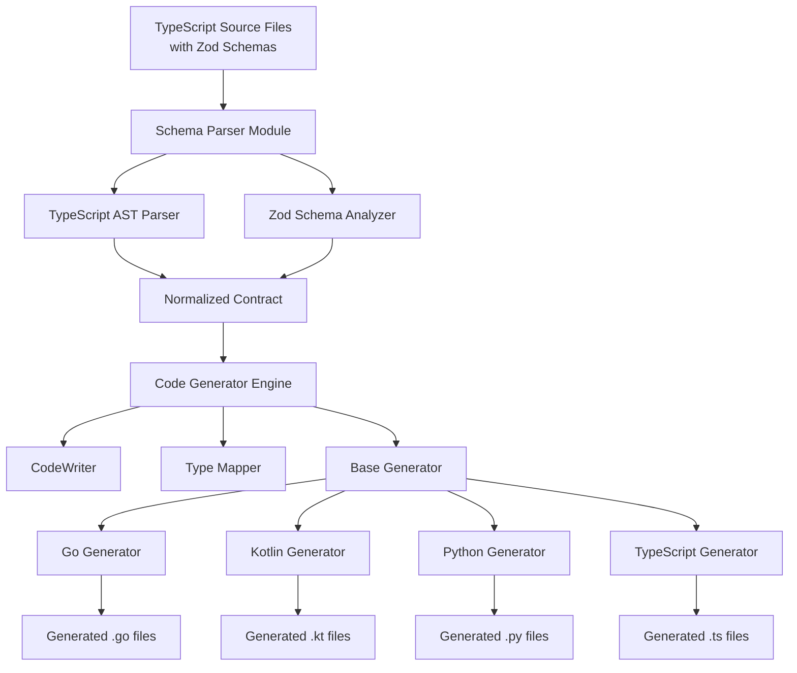
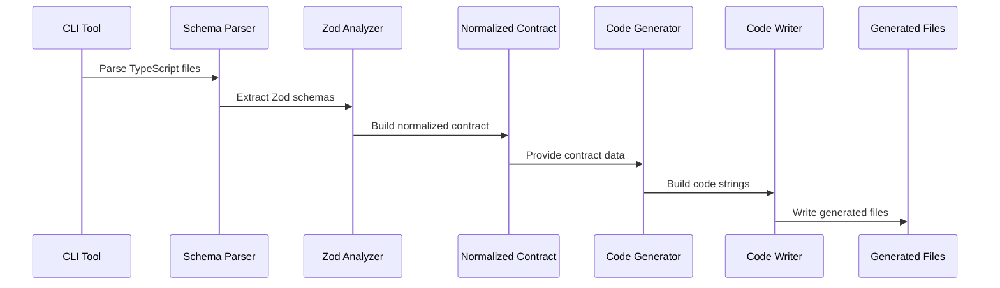

# Code Generation Architecture

This document provides a detailed technical specification for the xRpc code generation system. It describes the architecture, components, algorithms, and implementation details for transforming TypeScript/Zod schemas into idiomatic code for multiple target languages.

## Table of Contents

1. [Introduction](#introduction)
2. [System Architecture](#system-architecture)
3. [Schema Parsing & Normalization](#schema-parsing--normalization)
4. [Code Generation Engine](#code-generation-engine)
5. [Language-Specific Generators](#language-specific-generators)
6. [Zod v4 Integration](#zod-v4-integration)
7. [Type Mapping System](#type-mapping-system)
8. [File Structure & Organization](#file-structure--organization)
9. [Technical Specifications](#technical-specifications)

## Introduction

### Purpose

The xRpc code generation system transforms TypeScript source files containing Zod schemas into type-safe, idiomatic code for multiple programming languages. The system uses TypeScript-based generators that programmatically build code strings, following patterns established by GraphQL Codegen and Prisma.

### Key Principles

1. **Type Safety**: Full TypeScript type checking in generator code
2. **Idiomatic Output**: Generated code follows target language conventions
3. **Self-Contained**: Generated code includes all necessary components
4. **Framework-Specific**: Each target generates code for a specific framework
5. **Extensible**: Easy to add new language targets

### High-Level Flow

```
TypeScript Source Files (with Zod schemas)
    ↓
Schema Parser (TypeScript AST + Zod introspection)
    ↓
Normalized Contract (Language-agnostic representation)
    ↓
TypeScript Generators (Language-specific classes)
    ↓
Generated Code Files (.go, .kt, .py, .rs, .ts)
```

## System Architecture

### Component Overview

The code generation system consists of four main layers:

1. **Input Layer**: TypeScript source files with Zod schema definitions
2. **Processing Layer**: Parser and code generator modules
3. **Output Layer**: Generated source code files for each target language
4. **Runtime Layer**: Generated code executes in target language runtimes

### Architecture Diagram



### Data Flow



## Schema Parsing & Normalization

### TypeScript AST Parsing

The parser uses the TypeScript Compiler API to analyze source files and extract API contract information.

**Responsibilities**:
- Parse TypeScript source files into AST
- Identify router, endpoint, and endpoint definitions
- Extract Zod schema references
- Resolve type references and imports
- Build dependency graph

**Key Implementation Details**:

```typescript
interface ASTParser {
  parseSourceFile(filePath: string): SourceFile;
  extractRouterDefinitions(sourceFile: SourceFile): RouterDefinition[];
  extractZodSchemas(sourceFile: SourceFile): ZodSchemaReference[];
  resolveTypeReferences(typeRef: TypeReference): TypeDefinition;
}
```

**Process**:
1. Load TypeScript source files
2. Create TypeScript Program and SourceFile objects
3. Traverse AST nodes to find router definitions
4. Extract endpoint definitions (queries, mutations)
5. Identify Zod schema usages
6. Build normalized contract structure

### Zod Schema Introspection

Leverages Zod v4's introspection capabilities to extract schema information.

**Schema Internals Access**:

All Zod schemas expose a `_zod` property containing schema internals:

```typescript
interface ZodInternals {
  def: SchemaDefinition;  // Complete schema definition (JSON-serializable)
}

interface SchemaDefinition {
  type: string;  // "string", "object", "array", "union", etc.
  // ... type-specific properties
}
```

**Introspection Methods**:

1. **Direct Access via `_zod.def`**:
   ```typescript
   const schema = z.object({ name: z.string() });
   const def = schema._zod.def;
   const type = def.type;  // "object"
   ```

2. **Object Schema Properties via `.shape`**:
   ```typescript
   if (schema instanceof z.ZodObject) {
     for (const [key, value] of Object.entries(schema.shape)) {
       // value is a Zod schema - introspect recursively
       const valueType = value._zod.def.type;
     }
   }
   ```

3. **Type Checking with `instanceof`**:
   ```typescript
   if (schema instanceof z.ZodString) {
     // Handle string schema
   } else if (schema instanceof z.ZodNumber) {
     // Handle number schema
   } else if (schema instanceof z.ZodOptional) {
     const innerType = schema.unwrap();
     // Handle optional type
   }
   ```

**Recursive Schema Traversal**:

```typescript
function extractTypeInfo(schema: z.ZodType): TypeInfo {
  const def = schema._zod.def;
  const type = def.type;
  
  if (schema instanceof z.ZodObject) {
    return {
      kind: 'object',
      properties: Object.entries(schema.shape).map(([key, value]) => ({
        name: key,
        type: extractTypeInfo(value),  // Recursive
        required: !(value instanceof z.ZodOptional),
        metadata: value.meta(),
      })),
    };
  }
  
  if (schema instanceof z.ZodArray) {
    return {
      kind: 'array',
      elementType: extractTypeInfo(schema.element),
    };
  }
  
  if (schema instanceof z.ZodUnion) {
    return {
      kind: 'union',
      options: schema.options.map(opt => extractTypeInfo(opt)),
    };
  }
  
  // Handle primitives
  return {
    kind: type as PrimitiveType,
    metadata: schema.meta(),
  };
}
```

### Metadata Extraction

Zod v4 provides metadata system for attaching code generation hints.

**Metadata Access**:

```typescript
// Attach metadata to schema
const userSchema = z.object({
  name: z.string().meta({
    description: "User's full name",
    example: "John Doe",
    goTag: 'json:"name"',
    kotlinAnnotation: '@JsonProperty("name")',
  }),
});

// Extract metadata
const metadata = userSchema.shape.name.meta();
// Returns: { description: "...", goTag: "...", ... }
```

**Global Registry**:

```typescript
// Register schema with global registry
const emailSchema = z.string().email().register(z.globalRegistry, {
  id: "email_address",
  title: "Email address",
  description: "A valid email address",
});

// Access during code generation
const registryMetadata = z.globalRegistry.get(emailSchema);
```

### JSON Schema Conversion

Zod v4 provides native JSON Schema conversion that can serve as an intermediate format.

**Usage**:

```typescript
const jsonSchema = z.toJSONSchema(schema, {
  target: "openapi-3.0",  // For OpenAPI compatibility
  metadata: z.globalRegistry,  // Include metadata
  reused: "ref",  // Extract reused schemas as $defs
});

// JSON Schema can be transformed to normalized contract
function jsonSchemaToContract(jsonSchema: JSONSchema): NormalizedContract {
  // Transform JSON Schema structure to normalized contract
}
```

**Benefits**:
- Standardized intermediate format
- Well-documented conversion rules
- OpenAPI compatibility
- Metadata preservation

### Normalized Contract Structure

The normalized contract is a language-agnostic representation of the API.

```typescript
interface NormalizedContract {
  routers: Router[];
  types: TypeDefinition[];
  endpoints: Endpoint[];
  metadata?: ContractMetadata;
}

interface Router {
  name: string;
  endpoints: Endpoint[];
  metadata?: RouterMetadata;
}

interface Endpoint {
  name: string;
  endpoints: Endpoint[];
  metadata?: EndpointMetadata;
}

interface Endpoint {
  name: string;
  type: 'query' | 'mutation' | 'subscription';
  input: TypeReference;
  output: TypeReference;
  metadata?: EndpointMetadata;
}

interface TypeDefinition {
  name: string;
  kind: 'object' | 'array' | 'union' | 'primitive' | 'enum' | 'nullable' | 'optional';
  properties?: Property[];
  elementType?: TypeReference;  // For arrays
  options?: TypeReference[];    // For unions
  baseType?: string;            // For primitives
  metadata?: TypeMetadata;
}

interface Property {
  name: string;
  type: TypeReference;
  required: boolean;
  defaultValue?: unknown;
  metadata?: PropertyMetadata;
}

interface TypeReference {
  name?: string;  // For named types
  kind: TypeDefinition['kind'];
  // ... type-specific fields
}
```

## Code Generation Engine

### CodeWriter Pattern

The `CodeWriter` class provides a fluent API for building code strings with proper formatting.

**Implementation**:

```typescript
class CodeWriter {
  private lines: string[] = [];
  private indentLevel = 0;
  private indentString = '    ';  // 4 spaces (configurable)
  
  writeLine(text: string): void {
    const indent = this.indentString.repeat(this.indentLevel);
    this.lines.push(indent + text);
  }
  
  write(text: string): void {
    if (this.lines.length === 0) {
      this.lines.push('');
    }
    const lastLine = this.lines[this.lines.length - 1];
    this.lines[this.lines.length - 1] = lastLine + text;
  }
  
  indent(): void {
    this.indentLevel++;
  }
  
  unindent(): void {
    this.indentLevel = Math.max(0, this.indentLevel - 1);
  }
  
  newLine(): void {
    this.lines.push('');
  }
  
  block(fn: () => void): void {
    this.writeLine('{');
    this.indent();
    fn();
    this.unindent();
    this.writeLine('}');
  }
  
  toString(): string {
    return this.lines.join('\n');
  }
  
  reset(): void {
    this.lines = [];
    this.indentLevel = 0;
  }
}
```

**Usage Example**:

```typescript
const writer = new CodeWriter();
writer.writeLine('package main');
writer.newLine();
writer.writeLine('type User struct {');
writer.indent();
writer.writeLine('Name string `json:"name"`');
writer.writeLine('Age int `json:"age"`');
writer.unindent();
writer.writeLine('}');

const code = writer.toString();
// Output:
// package main
//
// type User struct {
//     Name string `json:"name"`
//     Age int `json:"age"`
// }
```

### Base Generator Architecture

All language-specific generators extend `BaseCodeGenerator`.

```typescript
abstract class BaseCodeGenerator {
  protected writer: CodeWriter;
  protected typeMapper: TypeMapper;
  protected config: GeneratorConfig;
  
  constructor(config: GeneratorConfig) {
    this.writer = new CodeWriter();
    this.typeMapper = this.createTypeMapper();
    this.config = config;
  }
  
  abstract generate(contract: NormalizedContract): GeneratedFiles;
  abstract createTypeMapper(): TypeMapper;
  
  protected toPascalCase(str: string): string {
    return str.charAt(0).toUpperCase() + str.slice(1)
      .replace(/[-_](.)/g, (_, c) => c.toUpperCase());
  }
  
  protected toCamelCase(str: string): string {
    const pascal = this.toPascalCase(str);
    return pascal.charAt(0).toLowerCase() + pascal.slice(1);
  }
  
  protected toSnakeCase(str: string): string {
    return str.replace(/([A-Z])/g, '_$1').toLowerCase();
  }
}
```

### Generator Lifecycle

1. **Initialization**: Generator instance created with configuration
2. **Contract Processing**: Normalized contract passed to generator
3. **Code Generation**: Generator builds code strings using CodeWriter
4. **Formatting**: Generated code formatted using language-specific formatter
5. **File Writing**: Formatted code written to output directory

```typescript
interface GeneratorConfig {
  outputDir: string;
  packageName?: string;
  framework?: string;
  options?: Record<string, unknown>;
}

interface GeneratedFiles {
  types?: string;      // Type definitions file content
  server?: string;      // Server code file content
  client?: string;      // Client SDK file content
  validation?: string;  // Validation code file content
}
```

## Language-Specific Generators

### Generator Interface

Each language generator implements the following pattern:

```typescript
class LanguageGenerator extends BaseCodeGenerator {
  generate(contract: NormalizedContract): GeneratedFiles {
    return {
      types: this.generateTypes(contract.types),
      server: this.generateServer(contract),
      client: this.generateClient(contract),
      validation: this.generateValidation(contract),
    };
  }
  
  private generateTypes(types: TypeDefinition[]): string {
    // Generate type definitions
  }
  
  private generateServer(contract: NormalizedContract): string {
    // Generate server code
  }
  
  private generateClient(contract: NormalizedContract): string {
    // Generate client SDK
  }
  
  private generateValidation(contract: NormalizedContract): string {
    // Generate validation code
  }
}
```

### Go Generator

**Type Generation**:

```typescript
class GoCodeGenerator extends BaseCodeGenerator {
  private generateTypes(types: TypeDefinition[]): string {
    this.writer.reset();
    this.writer.writeLine(`package ${this.config.packageName || 'server'}`);
    this.writer.newLine();
    
    for (const type of types) {
      this.generateType(type);
    }
    
    return this.writer.toString();
  }
  
  private generateType(type: TypeDefinition): void {
    if (type.description) {
      this.writer.writeLine(`// ${type.description}`);
    }
    
    this.writer.writeLine(`type ${this.toPascalCase(type.name)} struct {`);
    this.writer.indent();
    
    for (const prop of type.properties || []) {
      if (prop.description) {
        this.writer.writeLine(`// ${prop.description}`);
      }
      
      const goType = this.typeMapper.mapType(prop.type);
      const jsonTag = this.generateJSONTag(prop);
      
      this.writer.writeLine(
        `${this.toPascalCase(prop.name)} ${goType} \`${jsonTag}\``
      );
    }
    
    this.writer.unindent();
    this.writer.writeLine('}');
    this.writer.newLine();
  }
  
  private generateJSONTag(prop: Property): string {
    const metadata = prop.metadata;
    if (metadata?.goTag) {
      return metadata.goTag;
    }
    
    const tag = prop.required 
      ? `json:"${prop.name}"`
      : `json:"${prop.name},omitempty"`;
    
    return tag;
  }
}
```

**Server Generation**:

```typescript
private generateServer(contract: NormalizedContract): string {
  this.writer.reset();
  this.writer.writeLine(`package ${this.config.packageName}`);
  this.writer.newLine();
  this.writer.writeLine('import (');
  this.writer.indent();
  this.writer.writeLine('"context"');
  this.writer.writeLine('"encoding/json"');
  this.writer.writeLine('"net/http"');
  this.writer.unindent();
  this.writer.writeLine(')');
  this.writer.newLine();
  
  this.writer.writeLine('type Router struct {');
  this.writer.indent();
  // Generate handler fields
  this.writer.unindent();
  this.writer.writeLine('}');
  this.writer.newLine();
  
  this.writer.writeLine('func NewRouter() *Router {');
  this.writer.indent();
  this.writer.writeLine('return &Router{}');
  this.writer.unindent();
  this.writer.writeLine('}');
  this.writer.newLine();
  
  this.writer.writeLine('func (r *Router) ServeHTTP(w http.ResponseWriter, req *http.Request) {');
  this.writer.indent();
  // Generate HTTP handler logic
  this.writer.unindent();
  this.writer.writeLine('}');
  
  return this.writer.toString();
}
```

### Kotlin Generator

**Data Class Generation**:

```typescript
class KotlinSpringBootGenerator extends BaseCodeGenerator {
  private generateTypes(types: TypeDefinition[]): string {
    this.writer.reset();
    this.writer.writeLine(`package ${this.config.packageName || 'com.example.generated'}`);
    this.writer.newLine();
    
    for (const type of types) {
      this.generateDataClass(type);
    }
    
    return this.writer.toString();
  }
  
  private generateDataClass(type: TypeDefinition): void {
    if (type.description) {
      this.writer.writeLine(`/** ${type.description} */`);
    }
    
    this.writer.write(`data class ${this.toPascalCase(type.name)}(`);
    this.writer.newLine();
    this.writer.indent();
    
    const props = type.properties || [];
    for (let i = 0; i < props.length; i++) {
      const prop = props[i];
      const kotlinType = this.typeMapper.mapType(prop.type);
      const annotation = this.generateAnnotation(prop);
      
      if (annotation) {
        this.writer.writeLine(annotation);
      }
      
      this.writer.write(`val ${prop.name}: ${kotlinType}`);
      
      if (i < props.length - 1) {
        this.writer.write(',');
      }
      this.writer.newLine();
    }
    
    this.writer.unindent();
    this.writer.writeLine(')');
    this.writer.newLine();
  }
  
  private generateAnnotation(prop: Property): string | null {
    const metadata = prop.metadata;
    if (metadata?.kotlinAnnotation) {
      return metadata.kotlinAnnotation;
    }
    
    return `@JsonProperty("${prop.name}")`;
  }
}
```

### Python Generator

**Class Generation**:

```typescript
class PythonFastAPIGenerator extends BaseCodeGenerator {
  private generateTypes(types: TypeDefinition[]): string {
    this.writer.reset();
    this.writer.writeLine('from typing import Optional, List');
    this.writer.writeLine('from pydantic import BaseModel');
    this.writer.newLine();
    
    for (const type of types) {
      this.generateClass(type);
    }
    
    return this.writer.toString();
  }
  
  private generateClass(type: TypeDefinition): void {
    if (type.description) {
      this.writer.writeLine(`"""${type.description}"""`);
    }
    
    this.writer.writeLine(`class ${this.toPascalCase(type.name)}(BaseModel):`);
    this.writer.indent();
    
    for (const prop of type.properties || []) {
      if (prop.description) {
        this.writer.writeLine(`"""${prop.description}"""`);
      }
      
      const pythonType = this.typeMapper.mapType(prop.type);
      const typeHint = prop.required ? pythonType : `Optional[${pythonType}]`;
      
      this.writer.writeLine(`${prop.name}: ${typeHint}`);
      this.writer.newLine();
    }
    
    this.writer.unindent();
    this.writer.newLine();
  }
}
```

## Zod v4 Integration

### Schema Introspection API

The Zod analyzer provides utilities for introspecting Zod schemas.

```typescript
class ZodAnalyzer {
  getSchemaType(schema: z.ZodType): string {
    return schema._zod.def.type;
  }
  
  getObjectShape(schema: z.ZodObject): Record<string, z.ZodType> {
    return schema.shape;
  }
  
  getMetadata(schema: z.ZodType): Record<string, unknown> | undefined {
    return schema.meta();
  }
  
  isOptional(schema: z.ZodType): boolean {
    return schema instanceof z.ZodOptional;
  }
  
  isNullable(schema: z.ZodType): boolean {
    return schema instanceof z.ZodNullable;
  }
  
  unwrapOptional(schema: z.ZodOptional): z.ZodType {
    return schema.unwrap();
  }
  
  unwrapNullable(schema: z.ZodNullable): z.ZodType {
    return schema.unwrap();
  }
}
```

### Metadata Extraction System

```typescript
class MetadataExtractor {
  extractFieldMetadata(schema: z.ZodType): FieldMetadata {
    const metadata = schema.meta() || {};
    
    return {
      description: metadata.description as string | undefined,
      example: metadata.example as unknown,
      goTag: metadata.goTag as string | undefined,
      kotlinAnnotation: metadata.kotlinAnnotation as string | undefined,
      pythonField: metadata.pythonField as string | undefined,
      // ... other language-specific metadata
    };
  }
  
  extractTypeMetadata(schema: z.ZodType): TypeMetadata {
    const metadata = schema.meta() || {};
    
    return {
      id: metadata.id as string | undefined,
      title: metadata.title as string | undefined,
      description: metadata.description as string | undefined,
      examples: metadata.examples as unknown[] | undefined,
    };
  }
}
```

### JSON Schema Conversion Usage

```typescript
class JSONSchemaConverter {
  toNormalizedContract(schema: z.ZodType): TypeDefinition {
    // Option 1: Direct introspection
    return this.introspectDirectly(schema);
    
    // Option 2: Via JSON Schema
    const jsonSchema = z.toJSONSchema(schema, {
      target: 'openapi-3.0',
      metadata: z.globalRegistry,
    });
    return this.jsonSchemaToContract(jsonSchema);
  }
  
  private introspectDirectly(schema: z.ZodType): TypeDefinition {
    // Use _zod.def and instanceof checks
  }
  
  private jsonSchemaToContract(jsonSchema: JSONSchema): TypeDefinition {
    // Transform JSON Schema to normalized contract
  }
}
```

## Type Mapping System

### Type Mapper Interface

```typescript
interface TypeMapper {
  mapType(typeRef: TypeReference): string;
  mapPrimitive(type: PrimitiveType): string;
  mapObject(type: TypeDefinition): string;
  mapArray(type: TypeDefinition): string;
  mapUnion(type: TypeDefinition): string;
  mapEnum(type: TypeDefinition): string;
  mapNullable(type: TypeReference): string;
  mapOptional(type: TypeReference): string;
}
```

### Go Type Mapper

```typescript
class GoTypeMapper implements TypeMapper {
  mapType(typeRef: TypeReference): string {
    if (typeRef.kind === 'nullable') {
      return `*${this.mapType(typeRef.baseType!)}`;
    }
    
    if (typeRef.kind === 'optional') {
      return this.mapType(typeRef.baseType!);
    }
    
    switch (typeRef.kind) {
      case 'primitive':
        return this.mapPrimitive(typeRef.baseType!);
      case 'object':
        return this.toPascalCase(typeRef.name!);
      case 'array':
        return `[]${this.mapType(typeRef.elementType!)}`;
      case 'union':
        return 'interface{}';  // Go doesn't have unions
      case 'enum':
        return this.toPascalCase(typeRef.name!);
      default:
        return 'interface{}';
    }
  }
  
  mapPrimitive(type: string): string {
    const mapping: Record<string, string> = {
      'string': 'string',
      'number': 'float64',
      'integer': 'int',
      'boolean': 'bool',
      'date': 'time.Time',
      'uuid': 'string',
      'email': 'string',
    };
    
    return mapping[type] || 'interface{}';
  }
}
```

### Kotlin Type Mapper

```typescript
class KotlinTypeMapper implements TypeMapper {
  mapType(typeRef: TypeReference): string {
    if (typeRef.kind === 'nullable') {
      return `${this.mapType(typeRef.baseType!)}?`;
    }
    
    if (typeRef.kind === 'optional') {
      return this.mapType(typeRef.baseType!);
    }
    
    switch (typeRef.kind) {
      case 'primitive':
        return this.mapPrimitive(typeRef.baseType!);
      case 'object':
        return this.toPascalCase(typeRef.name!);
      case 'array':
        return `List<${this.mapType(typeRef.elementType!)}>`;
      case 'union':
        return 'Any';  // Kotlin's top type
      case 'enum':
        return this.toPascalCase(typeRef.name!);
      default:
        return 'Any';
    }
  }
  
  mapPrimitive(type: string): string {
    const mapping: Record<string, string> = {
      'string': 'String',
      'number': 'Double',
      'integer': 'Int',
      'boolean': 'Boolean',
      'date': 'java.time.LocalDateTime',
      'uuid': 'java.util.UUID',
      'email': 'String',
    };
    
    return mapping[type] || 'Any';
  }
}
```

### Python Type Mapper

```typescript
class PythonTypeMapper implements TypeMapper {
  mapType(typeRef: TypeReference): string {
    if (typeRef.kind === 'optional' || typeRef.kind === 'nullable') {
      return `Optional[${this.mapType(typeRef.baseType!)}]`;
    }
    
    switch (typeRef.kind) {
      case 'primitive':
        return this.mapPrimitive(typeRef.baseType!);
      case 'object':
        return this.toPascalCase(typeRef.name!);
      case 'array':
        return `List[${this.mapType(typeRef.elementType!)}]`;
      case 'union':
        return 'Union[' + typeRef.options!.map(t => this.mapType(t)).join(', ') + ']';
      case 'enum':
        return this.toPascalCase(typeRef.name!);
      default:
        return 'Any';
    }
  }
  
  mapPrimitive(type: string): string {
    const mapping: Record<string, string> = {
      'string': 'str',
      'number': 'float',
      'integer': 'int',
      'boolean': 'bool',
      'date': 'datetime.datetime',
      'uuid': 'uuid.UUID',
      'email': 'str',
    };
    
    return mapping[type] || 'Any';
  }
}
```

## File Structure & Organization

### Package Layout

```
packages/
├── core/
│   ├── parser/
│   │   ├── index.ts                 # Main parser entry point
│   │   ├── ast-parser.ts            # TypeScript AST parsing
│   │   └── zod-extractor.ts         # Zod schema extraction
│   │
│   ├── contract/
│   │   ├── index.ts                 # Contract type definitions
│   │   ├── types.ts                 # TypeDefinition, Endpoint, etc.
│   │   └── router.ts                # Router, Endpoint types
│   │
│   └── zod-analyzer/
│       ├── index.ts
│       ├── introspection.ts        # Schema introspection utilities
│       │   ├── getSchemaType()
│       │   ├── getObjectShape()
│       │   └── getMetadata()
│       ├── json-schema-converter.ts # Use z.toJSONSchema() as intermediate
│       └── metadata-extractor.ts    # Extract code generation metadata
│
├── generator/
│   ├── core/
│   │   ├── code-writer.ts           # CodeWriter class
│   │   ├── base-generator.ts        # BaseCodeGenerator abstract class
│   │   ├── naming.ts                # Naming convention utilities
│   │   └── formatter.ts             # Code formatting utilities
│   │
│   ├── type-mapper/
│   │   ├── index.ts
│   │   ├── base-mapper.ts           # BaseTypeMapper abstract class
│   │   └── mappers/
│   │       ├── go-mapper.ts         # Maps Zod types → Go types
│   │       ├── kotlin-mapper.ts     # Maps Zod types → Kotlin types
│   │       ├── python-mapper.ts     # Maps Zod types → Python types
│   │       ├── rust-mapper.ts       # Maps Zod types → Rust types
│   │       └── typescript-mapper.ts # Maps Zod types → TypeScript types
│   │
│   └── targets/
│       ├── go/
│       │   ├── index.ts             # Main GoCodeGenerator export
│       │   ├── generator.ts         # GoCodeGenerator class
│       │   ├── type-generator.ts    # Generate Go type definitions
│       │   ├── server-generator.ts  # Generate Go server code
│       │   ├── client-generator.ts  # Generate Go client SDK
│       │   └── validation-generator.ts # Generate Go validation code
│       │
│       ├── kotlin-spring-boot/
│       │   ├── index.ts
│       │   ├── generator.ts
│       │   ├── type-generator.ts
│       │   ├── server-generator.ts
│       │   ├── client-generator.ts
│       │   └── validation-generator.ts
│       │
│       ├── python-fastapi/
│       │   ├── index.ts
│       │   ├── generator.ts
│       │   ├── type-generator.ts
│       │   ├── server-generator.ts
│       │   ├── client-generator.ts
│       │   └── validation-generator.ts
│       │
│       └── typescript-express/
│           ├── index.ts
│           ├── generator.ts
│           ├── type-generator.ts
│           ├── server-generator.ts
│           ├── client-generator.ts
│           └── validation-generator.ts
│
└── cli/
    ├── index.ts                     # CLI entry point
    ├── commands/
    │   └── generate.ts              # Generate command implementation
    └── utils/
        ├── config-loader.ts         # Load xrpc.config.ts
        └── file-writer.ts           # Write generated files
```

### Generated Output Structure

```
project-root/
├── src/                             # Source TypeScript/Zod schemas
│   └── api.ts                       # API contract definition
│
└── generated/                       # Generated code (output directory)
    ├── go/
    │   └── server/
    │       ├── types.go             # Generated Go structs
    │       ├── router.go            # Generated http.Handler
    │       ├── client.go            # Generated Go client
    │       └── validation.go        # Generated validation code
    │
    ├── kotlin-spring-boot/
    │   ├── Types.kt                 # Generated Kotlin data classes
    │   ├── XrpcController.kt       # Generated Spring @RestController
    │   ├── Client.kt                # Generated Kotlin client
    │   └── Validation.kt           # Generated validation code
    │
    ├── python-fastapi/
    │   ├── types.py                # Generated Python classes
    │   ├── server.py                # Generated FastAPI routers
    │   ├── client.py                # Generated Python client
    │   └── validation.py            # Generated validation code
    │
    └── typescript-express/
        ├── types.ts                 # Generated TypeScript types
        ├── server.ts                # Generated Express middleware
        ├── client.ts                # Generated TypeScript client
        └── validation.ts            # Generated Zod validators
```

## Technical Specifications

### Type Definitions

**Core Types**:

```typescript
interface NormalizedContract {
  routers: Router[];
  types: TypeDefinition[];
  endpoints: Endpoint[];
  metadata?: ContractMetadata;
}

interface Router {
  name: string;
  endpoints: Endpoint[];
  metadata?: RouterMetadata;
}

interface Endpoint {
  name: string;
  endpoints: Endpoint[];
  metadata?: EndpointMetadata;
}

interface Endpoint {
  name: string;
  type: 'query' | 'mutation' | 'subscription';
  input: TypeReference;
  output: TypeReference;
  metadata?: EndpointMetadata;
}

interface TypeDefinition {
  name: string;
  kind: 'object' | 'array' | 'union' | 'primitive' | 'enum' | 'nullable' | 'optional';
  properties?: Property[];
  elementType?: TypeReference;
  options?: TypeReference[];
  baseType?: string;
  metadata?: TypeMetadata;
}

interface Property {
  name: string;
  type: TypeReference;
  required: boolean;
  defaultValue?: unknown;
  metadata?: PropertyMetadata;
}

interface TypeReference {
  name?: string;
  kind: TypeDefinition['kind'];
  baseType?: TypeReference;
  elementType?: TypeReference;
  options?: TypeReference[];
}
```

**Generator Types**:

```typescript
interface GeneratorConfig {
  outputDir: string;
  packageName?: string;
  framework?: string;
  options?: Record<string, unknown>;
}

interface GeneratedFiles {
  types?: string;
  server?: string;
  client?: string;
  validation?: string;
}

abstract class BaseCodeGenerator {
  protected writer: CodeWriter;
  protected typeMapper: TypeMapper;
  protected config: GeneratorConfig;
  
  abstract generate(contract: NormalizedContract): GeneratedFiles;
  abstract createTypeMapper(): TypeMapper;
}
```

### Algorithm Descriptions

**Schema Introspection Algorithm**:

```
function extractTypeInfo(schema: ZodType): TypeInfo
  def = schema._zod.def
  type = def.type
  
  if schema instanceof ZodObject:
    return {
      kind: 'object',
      properties: map(schema.shape, (key, value) => ({
        name: key,
        type: extractTypeInfo(value),  // Recursive
        required: !(value instanceof ZodOptional),
        metadata: value.meta()
      }))
    }
  
  if schema instanceof ZodArray:
    return {
      kind: 'array',
      elementType: extractTypeInfo(schema.element)  // Recursive
    }
  
  if schema instanceof ZodUnion:
    return {
      kind: 'union',
      options: map(schema.options, extractTypeInfo)  // Recursive
    }
  
  if schema instanceof ZodOptional:
    return {
      kind: 'optional',
      baseType: extractTypeInfo(schema.unwrap())  // Recursive
    }
  
  // Handle primitives
  return {
    kind: type,
    metadata: schema.meta()
  }
```

**Code Generation Algorithm**:

```
function generateCode(contract: NormalizedContract, target: Language): GeneratedFiles
  generator = createGenerator(target)
  generator.initialize(config)
  
  files = {
    types: generator.generateTypes(contract.types),
    server: generator.generateServer(contract),
    client: generator.generateClient(contract),
    validation: generator.generateValidation(contract)
  }
  
  for each file in files:
    formatted = formatCode(file, target)
    writeToDisk(formatted, outputPath)
  
  return files
```

### Interface Contracts

**Parser Interface**:

```typescript
interface SchemaParser {
  parseSourceFiles(filePaths: string[]): NormalizedContract;
  extractRouters(sourceFile: SourceFile): Router[];
  extractEndpoints(endpoint: EndpointNode): Endpoint[];
  resolveTypeReference(ref: TypeReference): TypeDefinition;
}
```

**Generator Interface**:

```typescript
interface CodeGenerator {
  generate(contract: NormalizedContract): GeneratedFiles;
  generateTypes(types: TypeDefinition[]): string;
  generateServer(contract: NormalizedContract): string;
  generateClient(contract: NormalizedContract): string;
  generateValidation(contract: NormalizedContract): string;
}
```

**Type Mapper Interface**:

```typescript
interface TypeMapper {
  mapType(typeRef: TypeReference): string;
  mapPrimitive(type: string): string;
  mapObject(type: TypeDefinition): string;
  mapArray(type: TypeDefinition): string;
  mapUnion(type: TypeDefinition): string;
  mapEnum(type: TypeDefinition): string;
}
```

## Summary

The xRpc code generation system uses TypeScript-based generators to transform Zod schemas into idiomatic code for multiple languages. Key components include:

1. **Schema Parser**: Extracts API contracts from TypeScript/Zod using AST parsing and Zod introspection
2. **Normalized Contract**: Language-agnostic representation of the API
3. **Code Generators**: TypeScript classes that build code strings using the CodeWriter pattern
4. **Type Mappers**: Convert Zod types to target language types
5. **Zod v4 Integration**: Leverages metadata, JSON Schema conversion, and introspection APIs

The system is designed to be type-safe, debuggable, maintainable, and extensible, following modern code generation patterns established by GraphQL Codegen and Prisma.
