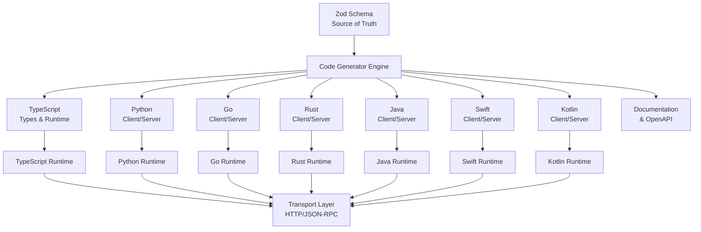
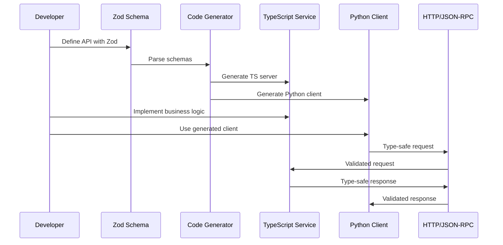

# xRpc Vision & Mission

## Vision

**xRpc envisions a world where developers can seamlessly share type-safe APIs across any platform, any language, and any transport protocol—without sacrificing developer experience or simplicity.**

We believe that type safety shouldn't be limited to single-language ecosystems, and that building distributed systems should feel as natural as writing local function calls. xRpc bridges the gap between the developer-friendly ergonomics of tRPC/oRPC and the cross-platform capabilities of gRPC, while providing a modern alternative to OpenAPI that prioritizes developer happiness over specification complexity.

## Mission

**To provide the most developer-friendly, cross-platform RPC framework that enables type-safe communication between services, applications, and platforms through a schema-first approach built on TypeScript and Zod.**

### Core Objectives

1. **Universal Type Safety**: Enable true end-to-end type safety across all major programming languages and platforms
2. **Exceptional Developer Experience**: Make building distributed systems feel as simple and intuitive as local development
3. **Schema-First Architecture**: Use Zod schemas as the single source of truth for all API contracts
4. **Cross-Platform Excellence**: Generate idiomatic, type-safe clients and servers for TypeScript, Python, Go, Rust, Java, Swift, Kotlin, and more
5. **Protocol Flexibility**: Support multiple transport protocols (HTTP/JSON-RPC, WebSocket) while maintaining a consistent developer interface
6. **Zero Compromise**: Combine the simplicity of tRPC with the portability of gRPC, without the complexity of OpenAPI

## Core Principles

### 1. Developer Experience First
Every design decision prioritizes developer happiness. If a feature makes the API harder to use, it doesn't belong. We measure success by how quickly developers can be productive, not by how many features we support.

### 2. Schema as Source of Truth
Zod schemas define contracts. Everything else—TypeScript types, client SDKs, server stubs, documentation—is generated from these schemas. This ensures consistency and eliminates drift between implementations.

### 3. Idiomatic by Default
Generated code should feel native to each target language. Python code should look like Python, Go code should look like Go. We don't force one language's patterns onto another.

### 4. Type Safety Without Compromise
Type safety is not optional. Runtime validation ensures that types match at runtime, not just compile time. This prevents entire classes of bugs in distributed systems.

### 5. Progressive Enhancement
Start simple, scale as needed. xRpc should work beautifully for a monorepo with shared types, scale to microservices, and support public API SDKs—all with the same core concepts.

## Key Differentiators

### vs. tRPC/oRPC
- **Cross-platform**: Not limited to TypeScript/JavaScript ecosystems
- **Language-agnostic**: Generate clients and servers for any major language
- **Protocol flexibility**: Not tied to a single transport mechanism

### vs. gRPC
- **Simpler**: No Protocol Buffers, no complex tooling, no binary serialization complexity
- **Web-native**: Built for HTTP/JSON from the ground up
- **Better DX**: Zod schemas are more intuitive than `.proto` files
- **TypeScript-first**: Native TypeScript support with full type inference

### vs. OpenAPI
- **Type-safe by default**: No manual type definitions or code generation configuration
- **Schema-first**: Zod schemas generate everything, including OpenAPI specs if needed
- **Better tooling**: Integrated validation, error handling, and type checking
- **Modern approach**: Built for modern TypeScript/JavaScript ecosystems

## Technical Approach

### Schema-First Architecture

### System Architecture Flow

### Core Components

1. **Schema Definition Layer**
   - Zod schemas define all API contracts
   - Endpoints (queries, mutations, subscriptions)
   - Type extraction and validation

2. **Code Generation Engine**
   - Multi-target code generator
   - Language-specific templates
   - Idiomatic code output

3. **Runtime Libraries**
   - Full-featured runtime for each target language
   - Request/response handling
   - Validation and error handling
   - Transport abstraction

4. **Developer Tools**
   - CLI for code generation
   - Type checking and validation
   - Development server with hot reload
   - Testing utilities

### Transport Protocol

- **Primary**: HTTP with JSON-RPC style messaging
- **Future**: WebSocket support for real-time communication
- **Extensible**: Protocol-agnostic core allows custom transports

## Target Use Cases

### 1. Monorepo Type Sharing
Enable seamless type sharing between frontend and backend services in a monorepo. Changes to schemas automatically propagate to all consumers.

### 2. Microservices Communication
Provide type-safe communication between microservices written in different languages. A Go service can call a TypeScript service with full type safety.

### 3. Full-Stack Applications
Build type-safe full-stack applications where frontend and backend share the same type definitions, eliminating API contract mismatches.

### 4. Public API SDKs
Generate idiomatic SDKs for public APIs in multiple languages, ensuring consistency and type safety across all client libraries.

### 5. Cross-Platform Mobile Apps
Share API contracts between web, iOS (Swift), and Android (Kotlin) applications with generated native clients.

## Success Metrics

### Developer Experience
- Time to first API call: < 5 minutes
- Zero configuration required for basic setup
- IntelliSense/autocomplete works out of the box
- Clear, actionable error messages

### Type Safety
- 100% type coverage across all generated code
- Runtime validation catches type mismatches
- Compile-time errors prevent invalid API calls

### Cross-Platform
- Support for 7+ major languages in v1.0
- Generated code passes language-specific linters
- Idiomatic patterns in each target language

### Performance
- Minimal runtime overhead
- Efficient serialization/deserialization
- Support for streaming and batching

### Adoption
- Easy migration from tRPC/oRPC
- Can generate OpenAPI specs for compatibility
- Works alongside existing API infrastructure

## Long-Term Vision

xRpc aims to become the de facto standard for type-safe, cross-platform RPC communication. We envision:

- **Ecosystem Growth**: Rich plugin ecosystem for custom generators and transports
- **Tooling Integration**: First-class support in popular IDEs and frameworks
- **Community Standards**: Industry adoption for API contracts and type sharing
- **Performance Leadership**: Best-in-class performance for type-safe RPC
- **Developer Advocacy**: The framework developers recommend to their teams

## Values

- **Simplicity over Features**: Better to do a few things exceptionally well
- **Developer Empathy**: We build tools we want to use ourselves
- **Open Source First**: Community-driven development and transparency
- **Type Safety Always**: No shortcuts that compromise type safety
- **Cross-Platform by Design**: Every feature considers multi-language implications

---

*"Type safety shouldn't stop at language boundaries."*
